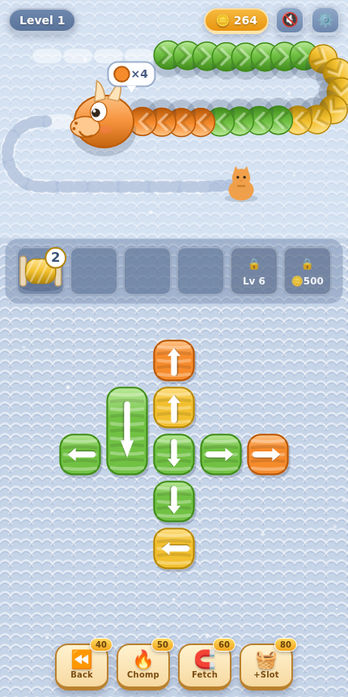
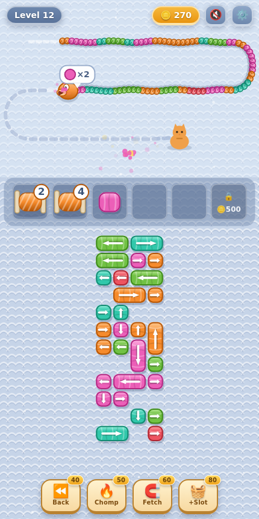

# 🧶 Wool Crush — Infinite

A knitted-wool puzzle game inspired by *Wool Crush*: pull wool bolts off the board, turn them into spools, and **wind the crawling wool dragon away before it reaches the kitty** — across endless procedurally generated levels that get progressively harder.

Everything lives in a single dependency-free `index.html`. Open it in any browser (works great on phones) and play.

| Level 1 | Level 12 |
|---|---|
|  |  |

## How to play

- The **wool dragon** crawls along the runway toward the kitty. If it reaches her, you lose.
- **Tap a wool bolt** to pull it off the board. A bolt only slides in its **arrow direction**, and only if the path to the edge is clear — blocked bolts wiggle and flash the piece in the way.
- A pulled bolt becomes a **spool** in the tray: small bolts hold 2 wraps, big ones 4.
- A spool automatically **winds matching wool off the dragon's head** — each crushed segment drags the dragon back. When a spool's number hits 0 it pops off (+coins) and frees its slot.
- Wrong-color spools **clog their slot** until their color comes up. Win by unraveling the dragon completely.

### Boosters (cost coins)

| Booster | Effect |
|---|---|
| ⏪ Back | Pushes the dragon back down the runway |
| 🔥 Chomp | Instantly crushes the head segments |
| 🧲 Fetch | Yanks a matching bolt out, ignoring blockers |
| 🧺 +Slot | Extra tray slot for the current level |

Coins come from popped spools and finished levels (with a no-booster bonus). You can unlock a permanent tray slot, and revive after a defeat with a big push-back.

## Infinite levels & difficulty

Every level is generated on the fly and is **guaranteed solvable**:

1. The board (diamond, heart, cross, ring, triangle, rectangle shapes) is tiled with 1- and 2-cell bolts.
2. A full extraction is simulated to find a feasible pull order (re-rolling arrows when the simulation jams).
3. The dragon's color sequence is derived from that order, then shuffled inside a small window — so a solution always exists within the tray's buffer size.

Difficulty ramps with the level number:

- board grows **~16 → ~52 cells** (dragon ~32 → ~104 segments)
- colors **3 → 6**, and same-color runs shrink
- arrows point outward early, then get increasingly knotted
- harder board shapes (triangle, ring) only appear at higher levels
- the dragon crawls faster, and the feed order gets more scrambled

Progress (level, coins, unlocked slots, sound) is saved in `localStorage`.

## Development

No build step, no dependencies — edit `index.html` and refresh. A small debug API is exposed on `window.__wool` (state inspection, tapping pieces, fast-forward stepping, level generation), which the Playwright-based checks used during development: generation was verified across levels 1–999 (wrap/segment parity, solvable order found in ≤ 11 ms), and a planning bot at human tap-speed — no boosters, no revives — wins ~100% of levels 1–7, ~85% around level 10, and ~half at level 30+.
