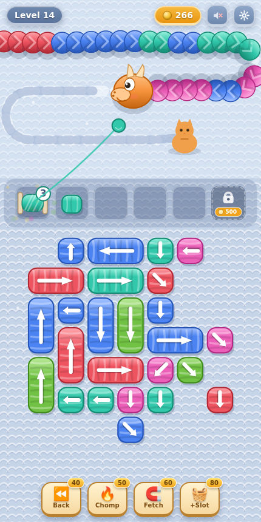
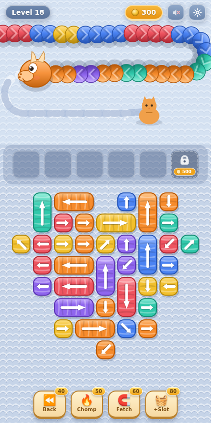

# 🧶 Wool Crush — Infinite

A knitted-wool puzzle game inspired by *Wool Crush*: pull wool bolts off the board, turn them into spools, and **unravel the crawling wool dragon before it reaches the kitty** — across endless procedurally generated levels that get progressively harder.

Everything lives in a single dependency-free `index.html`. Open it in any browser (works great on phones) and play.

| Level 14 | Level 18 |
|---|---|
|  |  |

## How to play

- The **wool dragon** crawls along the runway toward the kitty, and more of its body keeps **streaming in from offscreen**. If the head reaches her, you lose.
- **Tap a wool bolt** to pull it off the board. A bolt only slides in its **arrow direction**, and only if the path to the edge is clear — blocked bolts wiggle and flash the piece in the way.
- A pulled bolt becomes a **spool** in the tray: small bolts hold 2 wraps, big ones 4.
- Every spool automatically plucks its color from **any wool visible on screen** — segments zip out of the body, the body closes up, and each one **drags the dragon back**. Spools can all wind at once.
- A full spool pops off (+coins) and frees its slot. A spool whose color isn't on screen yet sits **dimmed**, clogging its slot until its color crawls in.

### Boosters (cost coins)

| Booster | Effect |
|---|---|
| ⏪ Back | Pushes the dragon back down the runway |
| 🔥 Chomp | Instantly crushes the two front segments |
| 🧲 Fetch | Yanks out a bolt matching the wool nearest the head |
| 🧺 +Slot | Extra tray slot for the current level |

Coins come from popped spools and finished levels (with a no-booster bonus). You can unlock a permanent tray slot, and revive after a defeat with a big push-back.

## Infinite levels & difficulty

Every level is generated on the fly with balanced wool: total spool capacity exactly matches the dragon's segments, and a feasibility simulation guarantees the whole board can always be emptied.

Difficulty ramps with the level number:

- the dragon crawls faster, while winding pushback weakens
- the visible window shrinks (more of the body hides offscreen)
- board grows **~16 → ~52 bolts' worth of cells** (dragon ~32 → ~104 segments)
- colors **3 → 7**, and same-color runs shorten
- arrows point outward early, then get increasingly knotted
- **diagonal arrows** appear from level 9, on more and more bolts
- harder board shapes (triangle, ring) only appear at higher levels

Progress (level, coins, unlocked slots, sound) is saved in `localStorage`.

## Development

No build step, no dependencies — edit `index.html` and refresh. A small debug API is exposed on `window.__wool` (state inspection, tapping pieces, fast-forward stepping, level generation), which the Playwright-based checks used during development: generation was verified across levels 1–999 (wrap/segment parity, solvable order found in ≤ 11 ms), and a slightly-imperfect planning bot at human tap-speed — no boosters, no revives — wins ~100% of levels up to ~22, ~88% at 26, and ~35% from level 30 on, where boosters and revives become part of the strategy.
