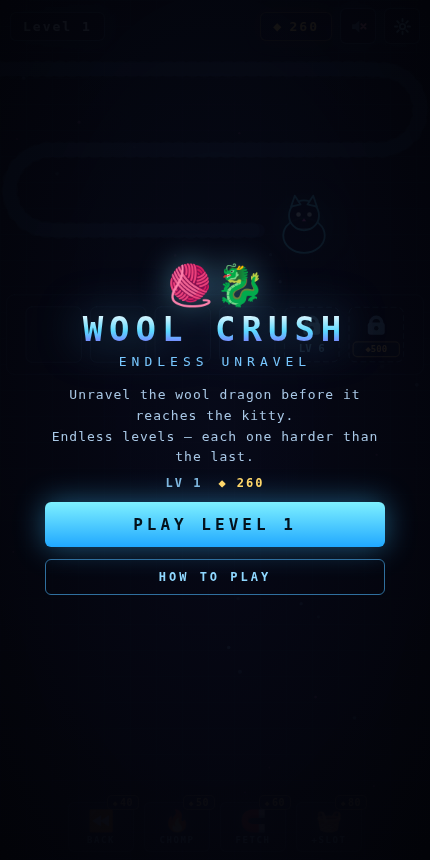
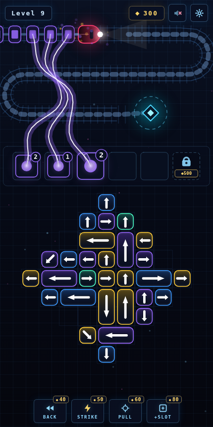

# ◆ NEON DERAIL — Endless Convoy

A minimal, addictive neon puzzle in the **NEON BASTION / NEON ROGUE** family: eject arrow blocks from the board, deploy them as cannons, and **shoot down the armored convoy car by car before it reaches the core** — across endless procedurally generated levels that get progressively harder.

Everything lives in a single dependency-free `index.html`. Open it in any browser (works great on phones) and play.

| Menu | Turrets lasering the convoy (Level 9) |
|---|---|
|  |  |

## How to play

- The **convoy starts offscreen** and rolls down the rails toward the core, more cars streaming in behind the locomotive. If it reaches the core, you lose.
- **Tap a block** to eject it. A block only slides in its **arrow direction** (diagonals appear at higher levels), and only if the path to the edge is clear — blocked taps flash the piece in the way.
- An ejected block deploys as a **cannon**: small blocks carry 2 shells, big ones 4.
- Every turret automatically fires at **any matching car on screen** — emitters track their targets, a **wavy energy laser** locks on, and every car destroyed **knocks the train back**. Turrets all fire at once; chain kills build a streak.
- A cannon out of shells discharges (+coins) and frees its slot. A cannon with no on-screen target sits **dimmed**, blocking its slot until its color rolls in.

### Boosters (cost ◆)

| Booster | Effect |
|---|---|
| ◀◀ Back | Pushes the convoy back down the line |
| ⌁ Strike | Instantly destroys the two lead cars |
| ⊕ Pull | Ejects a block matching the car nearest the engine |
| ▣ +Slot | Extra cannon slot for the current level |

Coins come from discharged cannons and finished levels (with a no-booster bonus). You can unlock a permanent slot, and revive after a defeat with a big push-back.

## Infinite levels & difficulty

Every level is generated on the fly with balanced totals: shell capacity exactly matches the convoy's cars, and a feasibility simulation guarantees the whole board can always be emptied.

Difficulty ramps with the level number:

- the convoy rolls faster, while knock-back weakens
- the visible window shrinks (more of the train hides offscreen)
- board grows **~16 → ~52 cells** (convoy ~32 → ~104 cars)
- colors **3 → 7**, and same-color runs shorten
- arrows point outward early, then get increasingly knotted; **diagonals** appear from level 9
- harder board shapes (triangle, ring) only appear at higher levels

Progress (level, coins, unlocked slots, sound) is saved in `localStorage`.

## Development

No build step, no dependencies — edit `index.html` and refresh. A small debug API is exposed on `window.__wool` (state inspection, tapping pieces, fast-forward stepping, level generation), which the Playwright-based checks used during development: generation was verified across levels 1–999 (shell/car parity, solvable order found in ≤ 11 ms), and a slightly-imperfect planning bot at human tap-speed — no boosters, no revives — wins ~100% of levels up to ~32, ~38% at 40, and ~13% at 50, where boosters and revives become part of the strategy.
